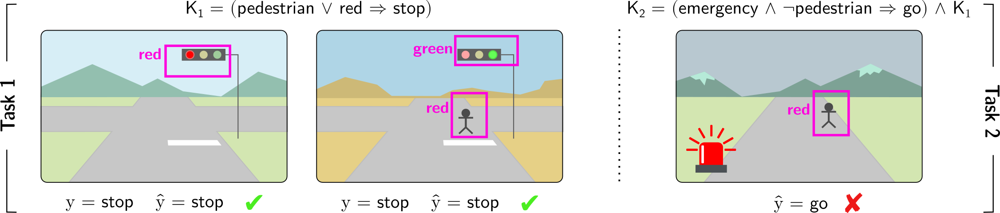
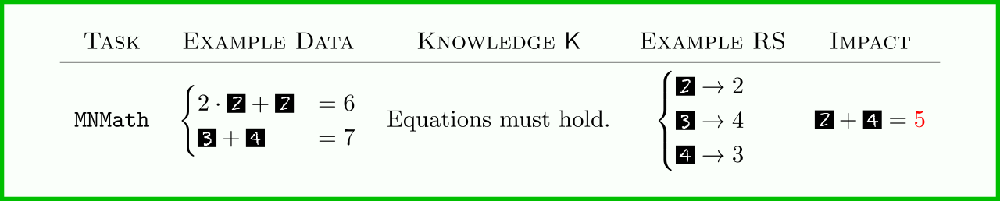
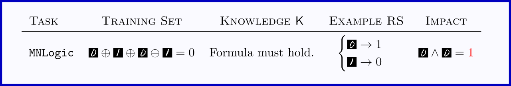
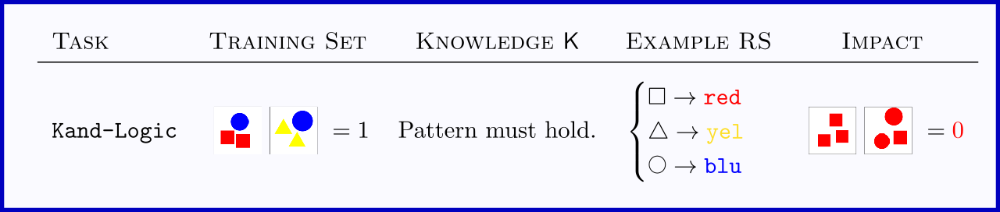
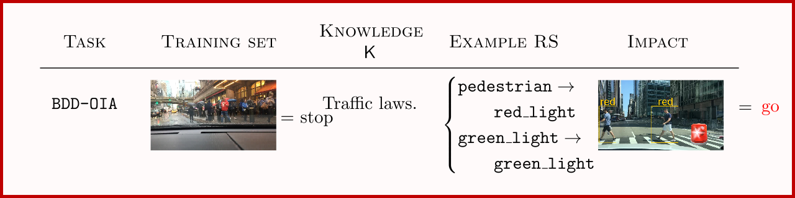
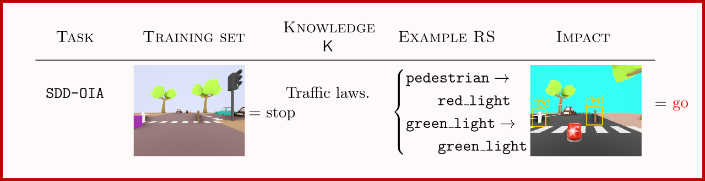



# Abstract

The advent of powerful neural classifiers has increased interest in problems
that require both learning and reasoning. These problems are critical for
understanding important properties of models, such as trustworthiness,
generalization, interpretability, and compliance to safety and structural
constraints. However, recent research observed that tasks requiring both
learning and reasoning on background knowledge often suffer from reasoning
shortcuts (RSs): predictors can solve the downstream reasoning task without
associating the correct concepts to the high-dimensional data. To address this
issue, we introduce rsbench, a comprehensive benchmark suite designed to
systematically evaluate the impact of RSs on models by providing easy access to
highly customizable tasks affected by RSs. Furthermore, rsbench implements
common metrics for evaluating concept quality and introduces novel formal
verification procedures for assessing the presence of RSs in learning tasks.
Using rsbench, we highlight that obtaining high quality concepts in both purely
neural and neuro-symbolic models is a far-from-solved problem.

<h1><a name="downloads">Downloads</a></h1>

### **Data**: [GDrive](https://drive.google.com/drive/folders/1PB4FZrZ_iZ_XH28u-nAykkVqMLDYqACB), [Zenodo](https://zenodo.org/doi/10.5281/zenodo.11612555)

### **Codebase**: [GitHub](https://github.com/unitn-sml/rsbench-code)

<h1><a name="background">What is a Reasoning Shortcut?</a></h1>

**What are L&R tasks?**  In learning and reasoning tasks, machine learning
models should predict labels that comply with prior knowledge.  For instance,
in autonomous vehicle scenario, the model should predict `stop` or `go` based
on what obstacles are visible in front of the vehicle, and the prior knowledge
encodes the rule that if a `pedestrian` or a `red_light` is visible then it
should definitely predict `stop`.

**What is a reasoning shortcut?**  A RS occurs when the model predicts the
right label by inferring the wrong concepts.  For instance, it might confuse
`pedestrian`s for `red_light`s as both entail the same (correct) `stop` action.

**What are the consequences?** RSs can compromise the *interpretability* of
model explanations (e.g., these might show that a prediction depends on the
`red_light`s present in the image, while in reality it depends on
`pedestrian`s!) and *generalization* to out-of-distribution tasks (e.g., if a
vehicle is authorized to cross over `red_light`s in the case of an emergency,
and it confuses these with `pedestrian`s, this might lead to harmful
decisions).

Image taken with permission from: Marconato *et
al.* "Not all neuro-symbolic concepts are created equal: Analysis and
mitigation of reasoning shortcuts." NeurIPS 2023.

<h1><a name="overview">Overview</a></h1>

- *A Variety of L&R Tasks*: rsbench offers five L&R tasks and at least one data
  set each.  The tasks come in different flavors -- *arithmetic*, *logic*, and
  *high-stakes* -- and with a formal specification of the corresponding prior
  knowledge.  rsbench also provides data generators for creating new OOD splits
  useful for testing the down-stream consequences of RSs.

- *Evaluation*: rsbench comes with implementations for several metrics for
  evaluating the quality of *label* and *concept* predictions, as well as
  visualization code for them.

- *Verification*: rsbench implements a new algorithm, `countrss`, that makes
  use of automated reasoning packages for formally veryfing whether a L&R task
  allows for RSs without training any model!  This tool works with any prior
  knowledge encoded in CNF format, the de-facto standard in automated
  reasoning.

- *Example code*: our repository comes with example code for training and
  evaluating a selection of state-of-the-art machine learning architectures,
  including Neuro-Symbolic models, Concept-bottleneck models, and regular
  neural networks.

| L&R Task        | Images       | Concepts                                                             | Labels                      | #Train | #Valid | #Test  | #OOD   |
| :--             | :--:         | :--:                                                                 | :--:                        | :--:   | :--:   | :--:   | :--:   |
| `MNMath`        | 28k x 28     | k digits, 10 values each                                             | categorical multilabel      | custom | custom | custom | custom |
| `MNAdd-Half`    | 56 x 28      | 2 digits, 10 values each                                             | categorical 0 ... 18        | 2,940  | 840    | 420    | 1,080  |
| `MNAdd-EvenOdd` | 56 x 28      | 2 digits, 10 values each                                             | categorical 0 ... 18        | 6,720  | 1,920  | 960    | 5,040  |
| `MNLogic`       | 28k x 28     | k digits, 10 values each                                             | binary                      | custom | custom | custom | custom |
| `Kand-Logic`    | 3 x 192 x 64 | 3 objects per image, 3 shapes, 3 colors                              | binary                      | 4,000  | 1,000  | 1,000  | -      |
| `CLE4EVR`       | 320 x 240    | n to m objects per image, 10 shapes, 10 colors, 2 materials, 3 sizes | binary                      | custom | custom | custom | custom |
| `BDD-OIA`       | 1280 x 720   | 21 binary concepts                                                   | binary multilabel, 4 labels | 16,082 | 2,270  | 4,572  | --     |
| `SDD-OIA`       | 469 x 387    | 21 binary concepts                                                   | binary multilabel, 4 labels | 6,820  | 1,464  | 1,464  | 1,000  |

<h1><a name="usage">Usage</a></h1>

We provide a simple tutorial designed to demonstrate how to load and use the data generated by `rsbench`. This tutorial is meant to give a quick overview and get you started with the data we provide. You can access the Google Colab tutorial using the following link:

[MNIST Math Google Colab](https://colab.research.google.com/drive/1QYizKR1yS9dT7pI7dRITdw0HrvIOGjEP#scrollTo=rHrAvZnU-fWe)

The example data used in the tutorial is `MNISTMath`. You can easily create and customize the task you want using our data generator. Once you have created your dataset, you can upload the `zip` file to your Google Drive and follow the tutorial to try it out.

<h2><a name="evaluation">Evaluation</a></h2>

For a more thorough evaluation of the model, we recommend exploring the `rsseval` folder in our code repository, which you can find here:

[`rsseval`](https://github.com/unitn-sml/rsbench-code/tree/main/rsseval)

Within this folder, you'll find a [notebook](https://github.com/unitn-sml/rsbench-code/blob/main/rsseval/rss/notebooks/evaluate.ipynb) dedicated to evaluating concept quality using the metrics discussed in our paper. This will help you assess the performance and quality of the models more comprehensively.

# MNMath

`MNMath` is a novel multi-label extension of `MNIST-Addition` [Manhaeve et al.,
2018](https://proceedings.neurips.cc/paper_files/paper/2018/hash/dc5d637ed5e62c36ecb73b654b05ba2a-Abstract.html)
in which the goal is to predict the result of a system of equations of
[MNIST](http://yann.lecun.com/exdb/mnist/) digits.  The input image is the
concatentation of all MNIST digits appearing in the system, and the output is a
vector with as many elements as equations. Models trained on this task can
learn to systematically extract the wrong digits from the input image.

**An example RS**:  For the (linear) system in the example above, a model can
confuse 3's with 4's and still perfectly predict the output of the system.
However, for a new, out-of-distribution task like `2 + 4`, it will wrongly
output `5`.

**Ready-made**: `MNAdd-Half` WRITEME

**Ready-made**: `MNAdd-EvenOdd` WRITEME

# MNLogic

RSs arise whenever the knowledge K allows deducing the right label from
multiple configurations of concepts. This form of non-injectivity is a standard
feature of most logic formulas, and in fact formulas as simple as the XOR are
riddled by RSs. `MNLogic` allows to probe the pervasiveness of RSs in random
logic formulas. Specifically, the input image is the concatenation of k MNIST
images of zeros and ones representing the truth value of k bits, and the
ground-truth label y is whether they satisfies the formula or not.

By default, the `MNLogic` assumes the formula is a k-bit XOR, but any other
formula can be supplied. rsbench provides code to generate random CNF formulas,
that is, random conjunctions of disjunctions (clauses) of k bits. The code
allows to control the number of bits k and the number of structure of the
random formula, that is, the number of clauses and their length. It also avoids
trivial data by ensuring each clauses is neither a tautology nor a
contradiction.

# Kand-Logic

This task, inspired by Wassily Kandinsky's paintings and [Mueller and Holzinger 2021](https://www.sciencedirect.com/science/article/pii/S0004370221000977) requires simple (but non-trivial) perceptual processing and relatively complex reasoning in classifying logical patterns on sets of images comprising different shapes and colors. For example,
each input can comprise two $$64 \times 64$$ images, i.e., $$x = (x_1, x_2)$$, each depicting three geometric primitives with different shapes (`square`, `triangle`, `circle`) and colors (`red`, `blue`, `yellow`). The goal is to predict whether $$x_1$$ and $$x_2$$ fit the same predefined logical pattern or not. The pattern is built out of predicates like `all primitives in the image have a different color`, `all primitives have the same color`, and `exactly two primitives have the same shape`.

Unlike `MNLogic`, in `Kand-Logic` each primitive has multiple attributes that cannot easily be processed separately.  This means that RSs can easily appear, e.g., confuse shape with color when either is sufficient to entail the right prediction, as in the example above. We provide the data set used in [Marconato et al. 2024](https://arxiv.org/abs/2402.12240) (3 images per input with 3 primitives each) and a generator that allows configuring the number of images and primitives per input and the pattern itself.

# CLE4EVR

WRITEME

# BDD-OIA

WRITEME

# SDD-OIA

WRITEME

<h1><a name="verification">Verification</a></h1>

`count-rss` is a small tool that is able to enumerate the RSs in a task by
reducing the task to model counting (`#SAT`).  In short, `count-rss` takes a
`DIMACS CNF` specification of the prior knowledge and a data set, and outputs a
`DIMACS CNF` specification of the RS counting problem, which can be fed to any
`#SAT` solver. Due to their large number even on seemingly simple tasks, we
suggest using the state-of-the-art approximate `#SAT` solver
[ApproxMC](https://github.com/meelgroup/approxmc).

## Generating the RSs counting encoding

Use `python gen-rss-count.py` for generating a DIMACS encoding of the counting task.

On small datasets/tasks, the count of RSs can be computed directly (and exactly) with the `-E` flag. 
For instance:

<code class="code-block">$ python gen-rss-count.py xor -n 3 -E</code>

computes all the RSs resulting from the XOR task on 3 variables with exhaustive supervision.

Partial/incomplete supervision can be controlled with `-d P` with `P` in `[0,1]`. For instance:

<code class="code-block">$ python gen-rss-count.py xor -n 3 -E -d 0.25</code>

computes all the RSs when only 1/4 (<it>i.e.</it> 2 examples) are provided. The optional `--seed`  argument sets the seed number.

Beyond illustrative the XOR case, random CNFs with `N` variables, `M` clauses of length `K` can be evaluated:

<code class="code-block">$ python gen-rss-count.py random -n N -m M -k K</code>

Custom task expressed in `DIMACS` format are supported, for instance:

<code class="code-block">$ python gen-rss-count.py cnf and.cnf</code>

Use the flag `-h` for help on additional arguments.

## Counting RSs with pyapproxmc

Once the encoding of the problem is generated with `gen-rss-count.py`, use:

<code class="code-block">$ python count-amc.py PATH --epsilon E --delta D</code>

for obtaining an (epsilon,delta)-approximation of the exact RS count.

Alternative solvers can be used analogously.  Exact solvers include [`pyeda`](https://pyeda.readthedocs.io/en/latest/) and
[`pysdd`](https://github.com/wannesm/PySDD).

<h1><a name="metadata">Metadata</a></h1>

Preliminary metadata for the datasets we provide in the `Zenodo` archive and `Google Drive` is listed here:

- [`bbox_kand_logic`](assets/metadata/bbox_kand_logic_croissant.json)
- [`kand_logic_croissant`](assets/metadata/kand_logic_croissant.json)
- [`sdd_oia`](assets/metadata/sddoia_croissant.json)
- [`sdd_oia_embeddings`](assets/metadata/sddoia_embeddings_croissant.json)

<h1><a name="license">License</a></h1>

**Code**: Most of our code is distributed under the [BSD
3](https://opensource.org/license/bsd-3-clause) license.  The `CLE4EVR` and
`SDDOIA` generators are derived from the `CLEVR` code base, which is
distributed under the permissive BSD license.  The `Kand-Logic` generator is
based on the `Kandinsky-patterns` code, which is available under the
[GPL-3.0](https://www.gnu.org/licenses/gpl-3.0.en.html) license, and so is our
generator.

**Data**: All ready-made data sets and generated datasets are distributed under
the [CC-BY-SA 4.0](https://creativecommons.org/licenses/by-sa/4.0/)
license, with the exception of `Kand-Logic`, which is derived from
`Kandinsky-patterns` and as such is distributed under the
[GPL-3.0](https://www.gnu.org/licenses/gpl-3.0.en.html) license.
